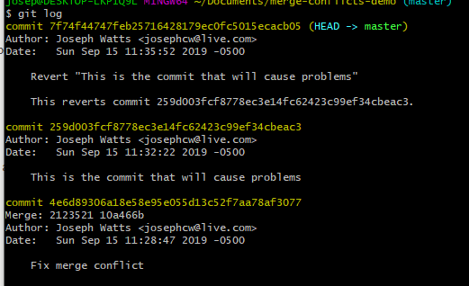

# Using TortoiseGit, Merge Conflicts, Reverts

## Tortoise Git Example

1. Go to the demo repo and clone the repo onto your machine.

2. Next you will create a branch. Right click on the folder the repos in and select "Create Branch". Name it Branch1 and then press ok.

3. Next you will right click the folder again and select "Switch/Checkout...". Then you will select the drop down arrows and choose Branch1. Once you have done that select "OK".

4. Open folder and then the txt file and change the top line to any word you want.

5. Right click on the folder the repos in and this time select "Git Commit - Branch1" Once the window opens on the bottom select the drop down arrow and choose "Commit and Push" then select "OK".

6. Right click the folder again and select "Switch/Checkout...". This time you from the drop down arrows choose Master. Once you have done that select "OK".

7. Next you right click the folder and select "Merge". When the window opens make sure that you choose branch and "Branch1" is selected. Once you do that select "OK". This will have merged your "Branch1" with the "Master".

8. You'll notice the txt file is red. Open it up and see the results. You have just created a merge conflict as you are trying to put two different things on the same line.

9. You'll want to remove the head and branch lines so that your left with each item in a different line. When your done it should be simliar to the second image below.

10. Next you will commit again and if a window pops up select ignore.
11. To revert back to a different commit right click the folder again and select "Switch/Checkout.." Choose the "Commit" option and then select the three dots on the right. It should pull up a window simliar to the second image below. From here you can choose to revert back to any commit you wich. Select "Master" and then hit "OK". This will have reverted you back to the orignal file.

## Git Bash Example

1. Create a new repository on your github account and then clone the repo with 'git clone \<Repository Url>'

2. Create a new text file and then add and commit the changes. Tortoise Git does both the staging of files and the committing in one step, but Git Bash does these two steps independently. Following standard unix style file paths one can stage a file to be committed using the 'git add \<Path / File Name>' command. After adding you can verify what was added using the 'git status' command. Now that the file changes are staged and ready to be committed, go ahead and commit it using the 'git commit -m "\<Message Here>"' command.

3. Create a new branch with the command 'git branch \<New Branch Name>', then check out the new branch using the command 'git checkout \<New Branch Name>'. This can also be achieved in one step by using 'git checkout -b \<New Branch Name>'.

4. Make some changes to the text.txt file and then commit. (No need to push)

5. At this point go ahead and switch back to the master branch by running 'git checkout master'. Make a change to the text.txt file and make another commit after staging the file.

6. One of the key differences between git and other SCM tools is that it allows you to have an entire separate copy of the project on your local machine and to work with branches all without effecting the copy that others are working with. Unfortunately a somewhat common biproduct of this process when two people are working on a related part of a program is a merge conflict. By being on the branch that you want the changes merged into, run the 'git merge \<Other Branch>' command.

7. As described above, git is unsure of how to handle multiple changes to the same line of a file. In order to 'help' the situation, git will put angle brackets and hyphens to separate the content it is unsure of.

8. Once you have manually modified the file to look the way that you believe is fit, go ahead and stage the files and then commit again. Congratulations, you've just solved a merge conflict!

9. Go ahead and make another change to the text file by adding another line of content to the end then commit.

10. Unfortunately, as it turns out, we actually didn't need that last change. If this change hadn't been pushed to a public repo where someone else had already done a 'git pull', then it's possible for us to do a 'git rebase'. Rebasing is generally considered dangerous because it's akin to rewriting existing history. As such, we will instead cover the nondestructive method to undo a commit, 'git revert'. The first step in doing a git revert is to get the unique hash id of the commit that we are wanting to undo. One easy way to get this is by running 'git log'

11. In this example our entire hash is '259d003fcf8778ec3e14fc62423c99ef34cbeac3'. Thankfully git will let use just the first 7 digits in order to do a revert. The revert command can be run with 'git revert \<commit hash>' it will afterwards ask for a commit message to be associated with this reversion.

12. You can also see this new commit in the log. Taking a look at the file you can also see that the line that was added is now gone.  

## Credits

### Joseph Watts

