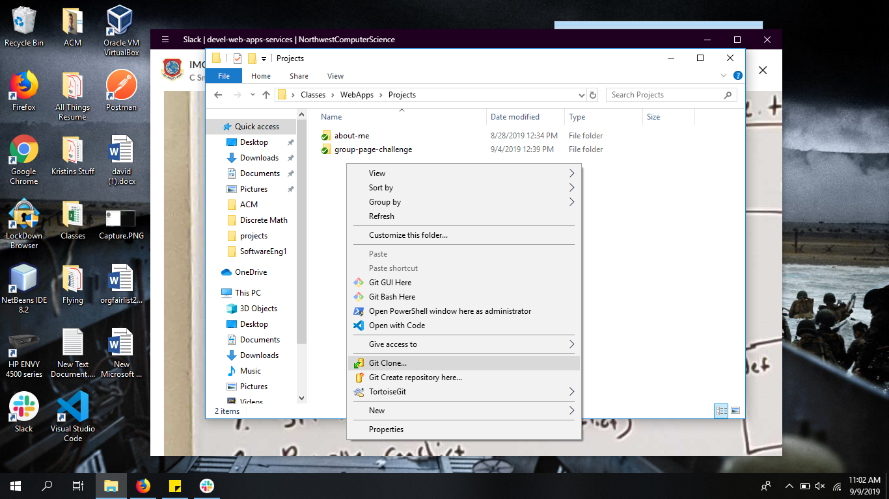
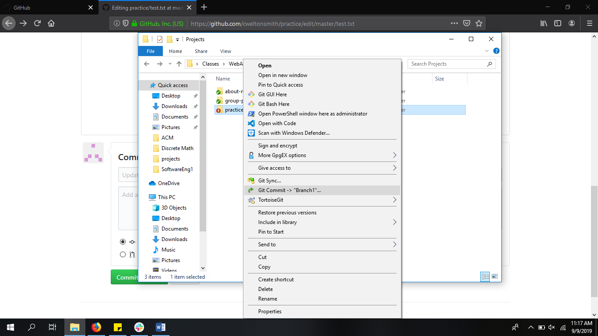
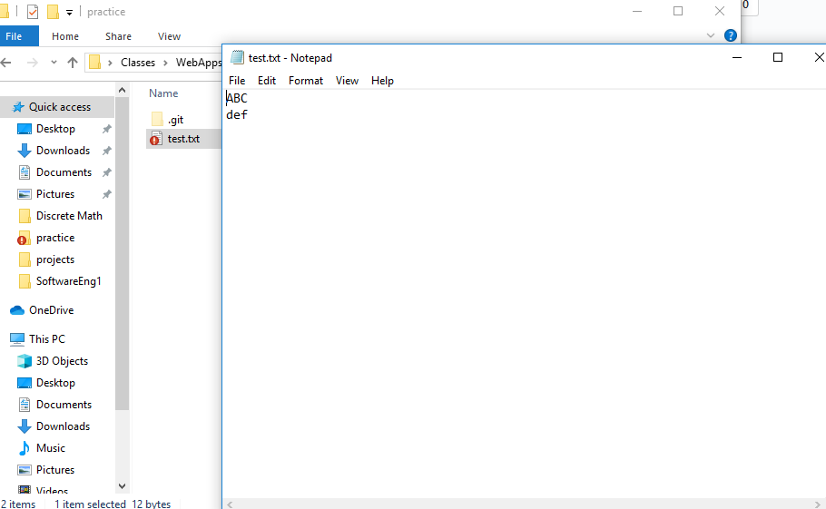

# Using TortoiseGit, Merge Conflicts, Reverts

## Tortoise Git Example

1. Go to the demo repo and clone the repot onto your machine.

2. Next you will create a branch. Right click on the folder the repos in and select "Create Branch". Name it Branch1 and then press ok.

3. Next you will right click the folder again and select "Switch/Checkout...". Then you will select the drop down arrows and choose Branch1. Once you have done that select "OK".

4. Open folder and then the txt file and change the top line to any word you want.

5. Right click on the folder the repos in and this time select "Git Commit - Branch1" Once the window opens on the bottom select the drop down arrow and choose "Commit and Push" then select "OK".

6. Right click the folder again and select "Switch/Checkout...". This time you from the drop down arrows choose Master. Once you have done that select "OK".

7. Next you right click the folder and select "Merge". When the window opens make sure that you choose branch and "Branch1" is selected. Once you do that select "OK". This will have merged your "Branch1" with the "Master".

8. You'll notice the txt file is red. Open it up and see the results. You have just created a merge conflict as you are trying to put two different things on the same line.

9. You'll want to remove the head and branch lines so that your left with each item in a different line. When your done it should be simliar to the second image below.

10. Next you will commit again and if a window pops up select ignore.
11. To revert back to a different commit right click the folder again and select "Switch/Checkout.." Choose the "Commit" option and then select the three dots on the right. It should pull up a window simliar to the second image below. From here you can choose to revert back to any commit you wich. Select "Master" and then hit "OK". This will have reverted you back to the orignal file.

## Git Bash Example

